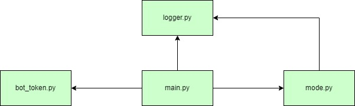
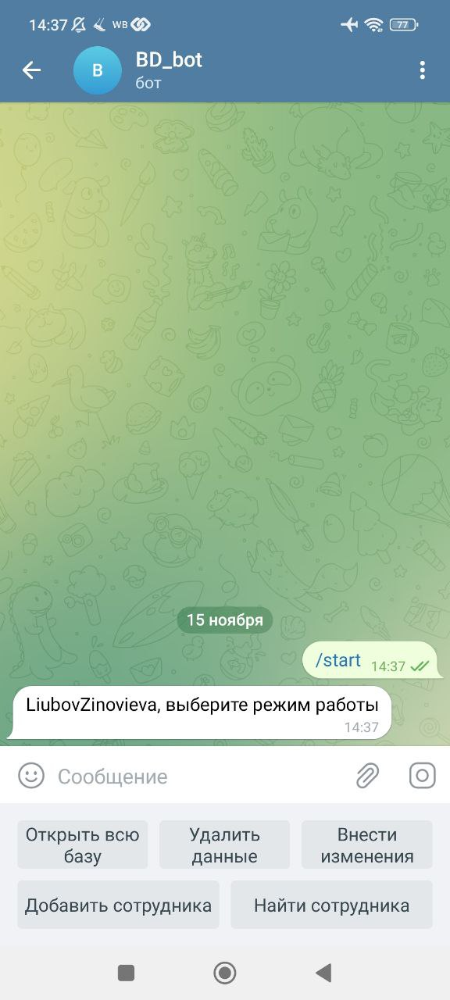
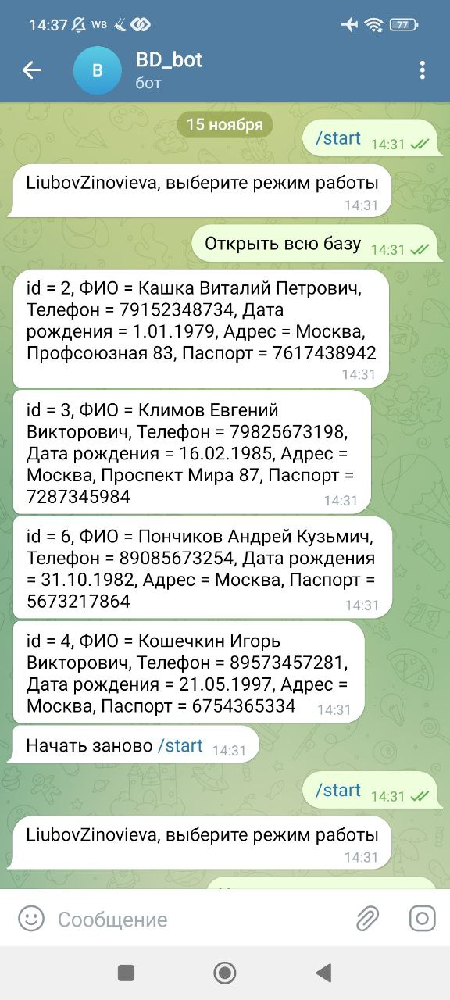
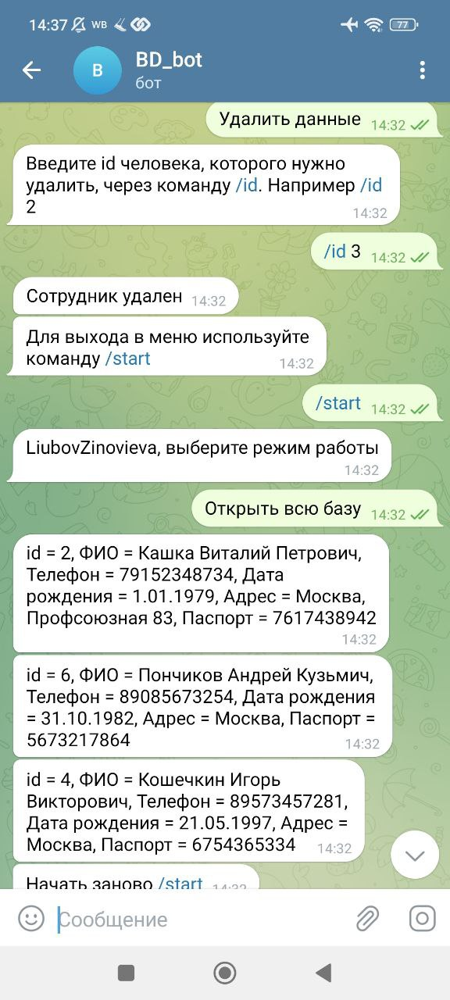
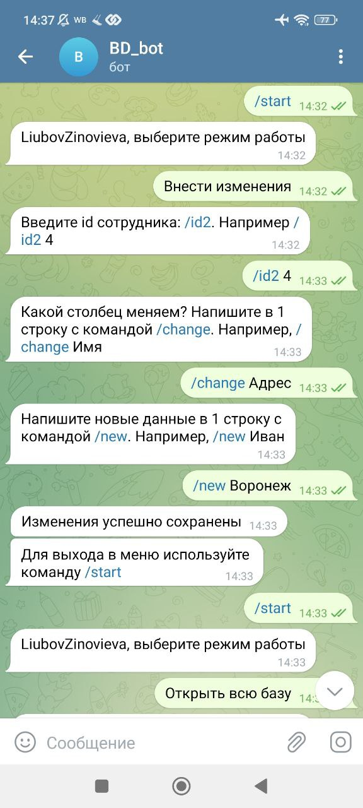
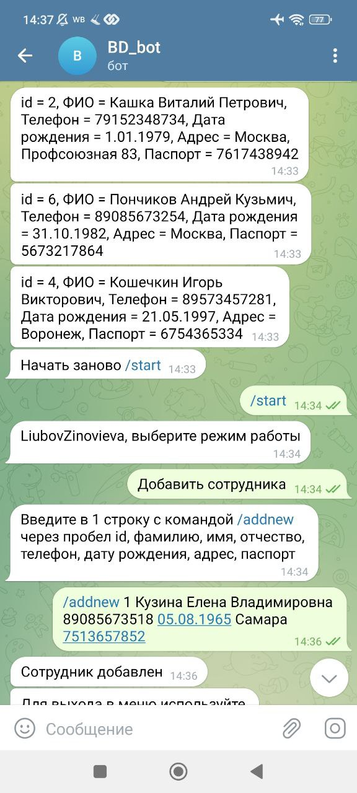
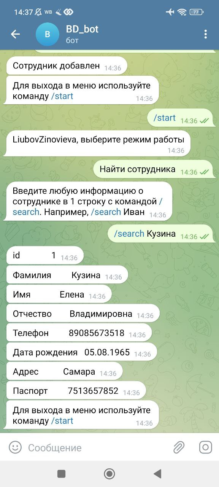

## **Telegram бот - база данных о сотрудниках @BD_Lu_bot**

База данных находится в файле log.json, содержит список словарей с сотрудниками. Имеем следующую 
информацию о сотруднике: *id, Фамилия, Имя, Отчество, Телефон, Дата рождения, Адрес, Паспорт.*

### *Возможности:* 
Просмотр, добавление/удаление сотрудника, внесение изменений, поиск сотрудника по любой 
имеющейся информации.

### *Блок-схема архитектуры приложения.* 
Схема обусловлена возможностями использованных библиотек telebot и PyTelegramBotAPI

### *Используемые модули:* 
1) **main.py** - с помощью команд через бота в меню(команда start) выбираем режим работы. 
    * Команда "Открыть всю базу" запускает метод load_data(), который загружает всех сотрудников в чат telegram
    * Команды "Удалить данные", "Внести изменения", "Добавить сотрудника" обращаются к модулю mod.py
    * Команда "Найти сотрудника" ищет сотрудника и печатает всю информацию о нем
 
2) **mod.py** - режимы:
   * delete_data() удаляет все данные об одном выбранном сотруднике;
   * data_replacement() заменяет уже имеющуюся информацию;
   * add_new_people() добавляет нового сотрудника

3) **logger.py** работает с базой данных:
    * load() загружает базу;
    * save() сохраняет базу    

4) **bot_token.py** хранит токен бота

### *Пример работы различных режимов бота:*

